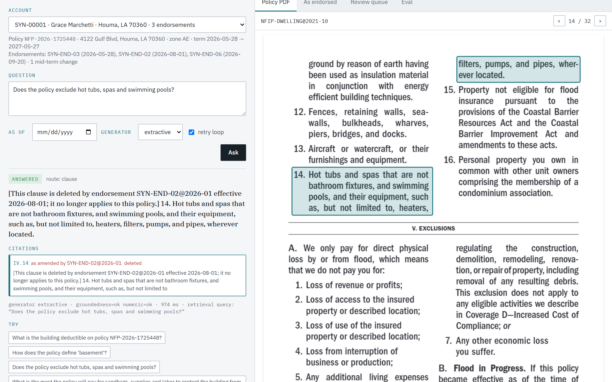

# As-Endorsed

Retrieval over insurance policies **as they currently read**, not as the base form was printed.

A policy is a declarations page, one or more base coverage forms, and a schedule of endorsements that replace, delete, or add clauses. Flat-chunk RAG retrieves whichever version of a clause scores highest. This system resolves the endorsement stack at ingest and answers from the resolved policy, citing the clause, the form it lives in, and the endorsement that last changed it.

> Status: **all five milestones built.** Runs locally or in one container; public deployment and the live Claude numbers wait on an account and an API key. See [Roadmap](#roadmap).

## Results first

Forty synthetic accounts on real public forms, 636 ground-truth questions, everything measured on a laptop CPU with no hosted model.

| What | Number |
|---|---:|
| Declarations questions (router + typed lookup), exact match | **100%** |
| Clause questions, correct chunk in top 5, clause-aware index + hybrid + rerank | 52% |
| Same, with the index holding the policy **as endorsed** | **89%** |
| Questions about an attached endorsement answered by a correct chunk, as-endorsed index | **100%** |
| Endorsement ops resolved on real TWIA endorsements | 17 of 20, 3 held for review with reasons |
| Money and short answers through the checked generator, exact | 100% (numeric guard: a fabricated amount is never released) |

Full tables with every rung, the metric definitions and the honest misses are in [Retrieval ladder](#retrieval-ladder-and-eval-harness) and [Cited generation](#cited-generation-with-checks).

## Run it

```bash
docker compose up api          # first start: downloads public forms + ONNX models, builds the synthetic book, ~5 min
open http://localhost:8000
```

Or locally:

```bash
python -m venv .venv && .venv/Scripts/activate      # or source .venv/bin/activate
pip install -e ".[dev]"
as-endorsed bootstrap                               # corpus, parses, accounts, extraction, resolution, warm models
uvicorn as_endorsed.api:app --port 8000
```



Pick an account, ask a question, and every citation opens the actual form page with the clause boxed, alongside the printed text and the text as endorsed. The other tabs show every clause the account's endorsements changed, the review queue of ops the engine would not apply on its own, and the eval tables. `GET /api/docs` has the OpenAPI schema; the interface is a thin framework-free client of that API so it ships in the same container.

To use Claude for generation, set `ANTHROPIC_API_KEY` (and optionally `AS_ENDORSED_LLM_MODEL`); without it the extractive generator answers and says so. [`fly.toml`](fly.toml) deploys the container with a persistent volume.

## What works today

```bash
python -m venv .venv && .venv/Scripts/activate      # or source .venv/bin/activate
pip install -e ".[dev]"

as-endorsed corpus download        # FEMA flood forms (public domain) + TWIA policy and endorsements
as-endorsed parse --all            # clause trees → data/parsed/*.json + outline.md
as-endorsed synth accounts -n 40   # declarations + endorsement PDFs + ground-truth Q&A
as-endorsed endorse synthetic      # extract ops from the synthetic library, score vs ground truth
as-endorsed endorse extract --all  # extract ops from the real TWIA endorsements
as-endorsed resolve                # apply attached endorsements to every account
as-endorsed review                 # held and unresolved ops → data/resolved/review.md
as-endorsed eval run               # build every index variant, run the ablation ladder
as-endorsed search "How does the policy define basement?" -a SYN-00001
as-endorsed ask "Does the policy exclude hot tubs?" -a SYN-00001   # cited answer, checks shown
as-endorsed eval generate --generator extractive                   # answer pipeline over the ground-truth set
as-endorsed bootstrap                                              # all of the above that is missing, in order
pytest
```

Models run in-process through ONNX (`fastembed`): BAAI/bge-small-en-v1.5 for embeddings and a MiniLM cross-encoder for reranking. No API key is needed for anything up to and including the eval; the optional LLM extractor and the generation milestone are the only parts that call a hosted model.

### Clause parser

`as_endorsed.ingest` turns a numbered policy form PDF into a clause tree with stable IDs, no LLM involved.

| Form | Numbering style | Pages | Clauses | Parser warnings |
|---|---|---:|---:|---:|
| NFIP Dwelling Form, F-122 (Oct 2021) | Roman sections, I.A.1.a.(1).(a).(i) | 32 | 498 | 0 |
| NFIP General Property Form, F-123 (Oct 2021) | Roman sections | 29 | 470 | 0 |
| TWIA Dwelling Policy (Aug 2023) | Word headings (CONDITIONS.4.a.(5)), quoted-term definitions | 17 | 255 | 4 |

Each clause carries a path in the form's own numbering (`II.C.6.b`), its parent, its own text (children are separate clauses), the defined term where it is a definition, and page plus bounding boxes for citation highlighting. Example record:

```json
{
  "clause_id": "NFIP-DWELLING@2021-10:II.C.5",
  "path": "II.C.5",
  "parent_path": "II.C",
  "term": "Basement",
  "text": "Basement. Any area of a building, including any sunken room or sunken portion of a room, having its floor below ground level on all sides.",
  "page_start": 4,
  "bboxes": [{"page": 4, "x0": 58.3, "y0": 307.3, "x1": 299.9, "y1": 346.3}]
}
```

How it stays honest:

- **Reading order is layout-derived.** Two-column pages with centred full-width headings are read band by band, left column then right. Header and footer lines are removed by repetition across pages, not by a form-specific pattern.
- **A label opens a clause only if it is the expected next label at its level.** `2.` inside running text never opens a bogus clause because the parser was expecting `B.`.
- **Continuation lines attach by indentation.** Wrapped text sits one step deeper than its label, so trailing text after a clause's children lands on the parent, not on the last child.
- **Two numbering styles.** Roman-numeral sections and word headings (`CONDITIONS`, `COVERAGE A (Dwelling)`) both become sections; unlabeled text under a section is split into paragraph clauses on vertical gaps, so a definitions section written as quoted-term paragraphs still yields one clause per term.
- **Failures are loud.** Anything the parser rejects is listed in `warnings`, and the test suite asserts the list is empty for the NFIP forms.

### Synthetic accounts

Real forms, synthetic declarations. `as_endorsed.synth` generates NFIP flood accounts deterministically from a seed: declarations, coverages within NFIP maximums, and for about forty percent of accounts a mid-term **General Change Endorsement** that alters a limit or deductible as of an effective date. Each account renders to a PDF that goes through the same ingestion path as real documents.

Accounts also attach zero to three endorsements from a synthetic library written against the real NFIP form (see below). `data/synthetic/qa.jsonl` holds 636 templated ground-truth rows: the declarations category (lookups, as-of questions, unanswerables) and the endorsement-resolved category, whose answers differ depending on which endorsements are attached and, for mid-term attachments, on the as-of date.

### Endorsement engine

`as_endorsed.endorse` turns endorsement prose into operations against the base form's clause tree and applies them in precedence order. This is the part no flat-chunk RAG has.

**Extraction** is rule-based first. The industry idiom is formulaic ("Condition 4.a.(5) is replaced by the following:", "The following section c. is added to Loss Settlement Condition 6.:", "Paragraph IV.14 is deleted."), so directives are matched sentence by sentence and the restated text after each directive is captured with the label structure the endorsement gave it. Targets are resolved deterministically against the clause tree by explicit path, by section name plus path, by heading words, or by defined term. Nothing is guessed: what the rules cannot place becomes an **unresolved** op (applied as a flagged sibling) or a **held** op (not applied; listed for review). An LLM extractor (`pip install -e ".[llm]"`, `--llm`) is wired in for text the rules cannot read, and its proposals go through the same resolver.

| Corpus | Ops | Resolved | Unresolved | Held | Note |
|---|---:|---:|---:|---:|---|
| Synthetic library (8 endorsements, ground truth known) | 8 | 6 | 1 | 1 | 8 of 8 expected ops extracted exactly; the unresolved one names no clause by design, the held one has schedule blanks |
| TWIA endorsements (11 real forms) | 20 | 17 | 0 | 3 | Held: a scanned PDF, a notice page, and an "It is agreed that" clause with no target |

**Resolution** applies REPLACE, DELETE, ADD, AMEND_DEF and schedule-filled ops per account. An endorsement controls over the base form; between endorsements the later effective date controls; same-date changes to the same clause are applied in schedule order and recorded as a conflict with both texts. Every changed clause keeps its original text and a lineage of the ops that touched it, and resolution can be run as of any date. Across the 40 synthetic accounts: 73 ops, 66 resolved, 7 unresolved, 0 held once schedule values are supplied, 64 clauses changed or added.

The scanned TWIA form is a real held case: there is no text layer, so the op is held with that reason rather than silently skipped. OCR is still open.

### Retrieval ladder and eval harness

`as_endorsed.retrieval` indexes each account's material five ways and `as_endorsed.eval` runs the ablation ladder over the ground-truth set. Every rung adds one thing, so the table reads as a story rather than a grid.

- **Router.** Limits, deductibles, premiums, dates and identifiers are typed facts on the declarations page. Questions about them go to a structured lookup on the account record, with as-of dates honoured; everything else goes to retrieval. Mixed questions run both.
- **Hard account filter.** Every search is scoped to one account before ranking. Cross-account leakage is a breach, not a relevance problem, so the filter is not optional.
- **Hybrid search.** Dense cosine and BM25 rankings fused with reciprocal rank fusion, then an optional cross-encoder rerank of the fused candidates, then optional pull-in of the definitions of defined terms that appear in the top hits.
- **Chunk variants.** `fixed` and `recursive` windows over the flat text; `clause` (one chunk per clause, endorsements as separate documents, the way a naive pipeline sees them); `resolved` (one chunk per clause *as endorsed*: replaced text in place, deleted clauses marked, added clauses present, unplaced endorsement text flagged); `header` (resolved plus a one-line contextual header: form, section path, heading, modified-by). Window chunks still record which clause paths they cover so hit@k is scored fairly for every rung.
- **As-of views on demand.** For a question about a past date, the account is re-resolved as of that date and indexed just for that query. Embeddings are content-addressed and cached, so this costs milliseconds.
- **Metrics.** `hit@k` and MRR on expected clause paths, plus `answer@k`: a retrieved chunk carries the *current* answer. For a policy with an endorsement attached that means the clause as amended, or the endorsement text naming the clause it changes; for a policy without, the unamended clause. That is the metric that separates a chunk that looks relevant from one that is right. Latency is wall-clock per query on CPU.
- **Backends.** An in-memory index (numpy + BM25) runs the eval and tests; a Postgres + pgvector backend with the same interface (`docker compose up db`) is there for serving.

#### Results

Embedder: `BAAI/bge-small-en-v1.5` · Reranker: `Xenova/ms-marco-MiniLM-L-6-v2` · k=5 · accounts=40

Declarations (router + structured lookup): exact match **100.0%** on 447 questions; routed to lookup 100.0%.

| Rung | Configuration | Chunks | hit@k | MRR | answer@k | resolved | negative | as-of | p50 ms | p95 ms |
|---|---|---:|---:|---:|---:|---:|---:|---:|---:|---:|
| 1 | fixed + dense | 1,793 | 60.3% | 0.31 | **73.1%** | 70% | 76% | 74% | 65 | 78 |
| 2 | recursive + dense | 1,673 | 23.8% | 0.16 | **56.0%** | 70% | 34% | 68% | 65 | 77 |
| 3 | clause + dense | 20,258 | 56.1% | 0.50 | **42.3%** | 28% | 65% | 32% | 66 | 77 |
| 4 | clause + hybrid | 20,258 | 56.1% | 0.39 | **42.3%** | 28% | 65% | 32% | 68 | 80 |
| 5 | clause + hybrid + rerank | 20,258 | 61.4% | 0.40 | **52.2%** | 40% | 79% | 26% | 1342 | 1546 |
| 6 | resolved + hybrid + rerank | 20,102 | 83.1% | 0.72 | **89.0%** | 100% | 76% | 88% | 1357 | 1552 |
| 7 | header + hybrid + rerank | 20,102 | 83.1% | 0.71 | **89.0%** | 100% | 76% | 88% | 1603 | 6123 |
| 7d | header + hybrid + rerank + defs | 20,102 | 83.1% | 0.71 | **89.0%** | 100% | 76% | 88% | 1538 | 1859 |

Reading the table: rung 1 scores well only because a 512-token window covers eight or more clauses at once, and `answer@k` gives it credit whenever the whole endorsement document lands in a window; a generator then has to reconcile the base clause and the endorsement itself. The clause-level rungs are scored on the single right clause. Hybrid search (rung 4) did not beat dense alone on these short paraphrased questions, and the contextual header (rung 7) neither helped nor hurt; both are reported as measured. The move from rung 5 to rung 6 is the project's thesis in one line: same retrieval, same reranker, but the index now holds the policy as endorsed, so the chunk that comes back is the current text with its lineage rather than the printed base form, and every question about an attached endorsement is answered by a correct chunk. Reranked latency is the MiniLM cross-encoder scoring 30 candidates on a laptop CPU; this run shared the machine with the test suite, and an uncontended run measures about 620 ms at p50. Generation quality on top of these hits is measured in the next section.

### Cited generation with checks

`as_endorsed.generate` turns retrieved clauses into an answer that can be trusted or refused, never merely produced.

```
route ─► declarations lookup (typed facts, cited to the declarations page)
     └► retrieve (account-scoped, as-of aware) ─► draft ─► checks ─► answer
                    ▲                               │
                    └── one rewrite-and-retry ◄── can't answer
```

- **Every sentence is a claim with citations.** The generator returns claims tied to chunk ids, not free text. Claude is called with a structured output schema; the extractive generator returns the best-matching clause as its single claim.
- **Groundedness check.** A claim survives only if a cited chunk lexically supports it: most of its content words, and every dollar amount and number in it, appear in that chunk. Unsupported claims are dropped; an answer with nothing left is withheld.
- **Numeric guard.** The number the answer turns on must appear in a cited clause or be the declarations value. A fabricated amount is never released.
- **Abstention.** "The policy does not address this" is a valid outcome, cited to what was retrieved, and the eval rewards it on unanswerable questions.
- **One loop, hard-capped.** When the generator cannot answer, a grader names what is missing and rewrites the retrieval query once; the pipeline retrieves again and drafts again. It never loops twice. The eval reports how often it fired.
- **Two generators, one contract.** `claude` (Claude Opus 5 by default, configurable) is the real one; `extractive` uses no model and exists so the whole pipeline runs and is measured without credentials, and so the checks are exercised by something that can be wrong. Credentials are resolved by the SDK; none are present on the machine this was built on, so the Claude path is tested against a stub client and its live numbers are still to be run.

#### Results, extractive generator

Generator: `extractive` · retrieval rung: 7d · loop: on · questions: 636

| Metric | Value |
|---|---:|
| Exact match (money, dates, short text; n=433) | **100.0%** |
| Lexical correctness proxy (long text, ≥0.6 overlap; n=199) | 62.3% |
| LLM-judged correctness | no model configured |
| Abstention precision / recall (unanswerable) | 9% / 100% |
| Citation@1 hits an expected clause | 64.6% |
| Withheld by checks | 0.0% |
| Abstained | 6.9% |
| Rewrite-and-retry loop fired | 0.0% |
| Latency p50 / p95 (ms) | 0 / 1750 |

| Category | n | exact | lexical ≥0.6 | cite@1 |
|---|---:|---:|---:|---:|
| declarations/as-of | 51 | 100% | – | – |
| declarations/lookup | 392 | 100% | 100% | – |
| declarations/unanswerable | 4 | – | – | – |
| endorsement-resolved/as-of | 37 | 100% | 57% | 38% |
| endorsement-resolved/negative | 72 | 100% | 20% | 74% |
| endorsement-resolved/resolved | 80 | 100% | 80% | 68% |

Reading the table: the declarations questions are exact because the router answers them from the record, and every money answer on the clause questions is exact because the numeric guard only lets through an amount that appears in the cited clause. On long-text answers the extractive generator can only hand back a clause verbatim, so correctness is a lexical proxy and is where a real generator earns its cost. Nothing was withheld because this generator's claims *are* the cited chunk, so they ground trivially; the groundedness and numeric checks bite on a generator that paraphrases, which the stub tests exercise (a fabricated $9,999 is refused). Its abstention precision is low for the same reason: it abstains whenever no retrieved clause shares two of the question's terms, which on this set mostly happened on clause questions it should have answered. Rerunning with `--generator claude --judge` once credentials are configured fills in the LLM-judged row, the loop rate, and a meaningful abstention number.

## Repository layout

```
src/as_endorsed/
  corpus/registry.py     public form registry + downloader (FEMA, TWIA)
  ingest/pdf.py          PDF → ordered lines with coordinates, header/footer strip
  ingest/clauses.py      clause tree parser (Roman and word-heading styles, paragraphs)
  endorse/refs.py        clause reference → path resolver
  endorse/extract.py     rule-based op extraction
  endorse/llm.py         optional LLM extraction (same resolver, same schema)
  endorse/resolve.py     precedence resolver, as-of materialisation
  endorse/pipeline.py    data/ plumbing shared by CLI and tests
  retrieval/chunking.py  the five chunk variants, with clause-path coverage
  retrieval/embed.py     bge-small via ONNX, hash stand-in, content-addressed cache
  retrieval/index.py     in-memory and pgvector indexes, RRF, search, definition pull-in
  retrieval/rerank.py    cross-encoder rerankers
  retrieval/router.py    declarations router + structured lookup
  eval/harness.py        the ablation ladder and its metrics
  eval/generation.py     the answer-pipeline eval
  api.py                 FastAPI: accounts, ask, PDFs, clauses with boxes, review, eval
web/                     the reference client (pdf.js highlights the cited clause's boxes)
  generate/schema.py     Claim, Draft, Answer: the generator contract
  generate/pipeline.py   route → retrieve → draft → groundedness → numeric guard → loop
  generate/llm.py        Claude generator, grader and judge (structured outputs, injectable client)
  generate/extractive.py the no-model generator
  synth/accounts.py      synthetic account generator
  synth/endorsements.py  synthetic endorsement library with ground truth
  synth/render.py        declarations + change endorsement PDF renderer
  synth/qa.py            ground-truth question templates
  models.py              shared pydantic records (Clause, ParsedForm, ...)
  cli.py, cli_endorse.py, cli_retrieval.py, cli_generate.py   `as-endorsed` entry point
tests/                   parser and engine tests run against the real forms
data/                  raw, parsed, synthetic (gitignored; regenerate with the CLI)
```

## Licensing

Only public-domain or openly published forms are in the registry. FEMA's Standard Flood Insurance Policy forms are US Government works. The Texas Windstorm Insurance Association publishes its dwelling policy and endorsements openly on twia.org; they are downloaded by script and not committed. Forms owned by Insurance Services Office (ISO) are copyrighted and are never committed to this repository. Citizens Florida keeps its forms behind an agent login and is therefore not a corpus source.

## Roadmap

1. **Corpus and parser** (done): NFIP forms, clause tree, synthetic accounts, ground-truth Q&A.
2. **Endorsement engine** (done): operation extraction, target validation against the clause tree, precedence resolution, held-ops review list, TWIA policy and endorsement library, endorsement-resolved ground truth.
3. **Retrieval ladder** (done): declarations router, hybrid dense + BM25 with reciprocal rank fusion, cross-encoder rerank, definition pull-in, as-of views, in-memory and pgvector indexes, eval harness with the ablation table.
4. **Generation** (done): claim-level citations, groundedness check, numeric guard, abstention, one bounded retrieve-again loop, generation eval; Claude path built and stub-tested, live numbers pending credentials.
5. **Ship** (built): FastAPI + reference client with PDF clause highlighting from the parser's bounding boxes, Dockerfile and compose, `bootstrap` command, Fly config. Still open: a public URL (needs an account), the demo video, and OCR for scanned forms.

## Boundaries

The system reports what a policy says and where. It does not make coverage determinations, and it does not interpret ambiguity. Where two endorsements conflict beyond what the precedence rules resolve, both texts are surfaced as a conflict.
